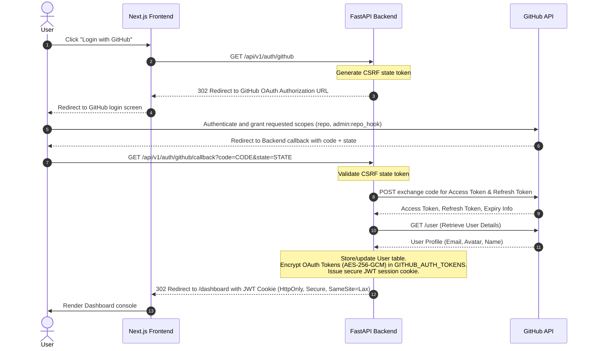
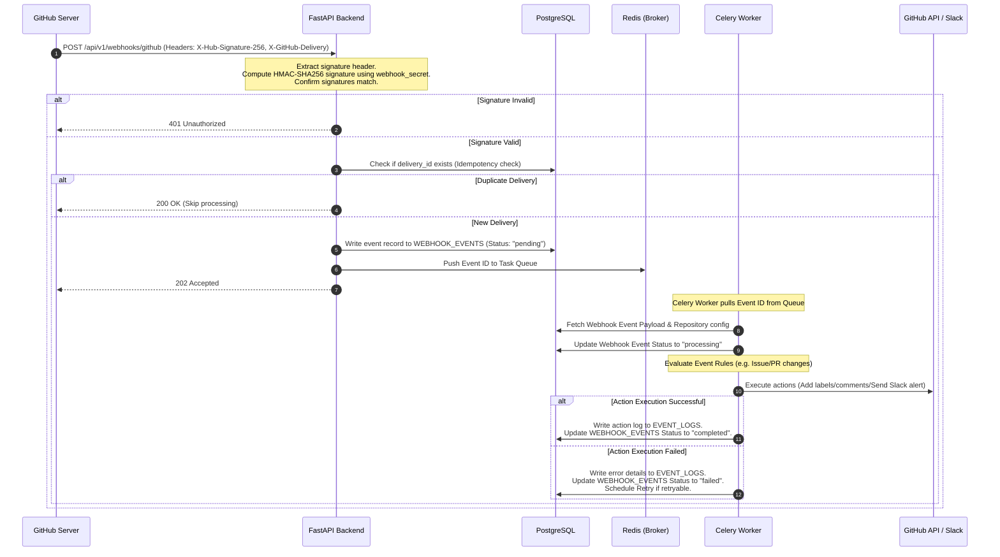
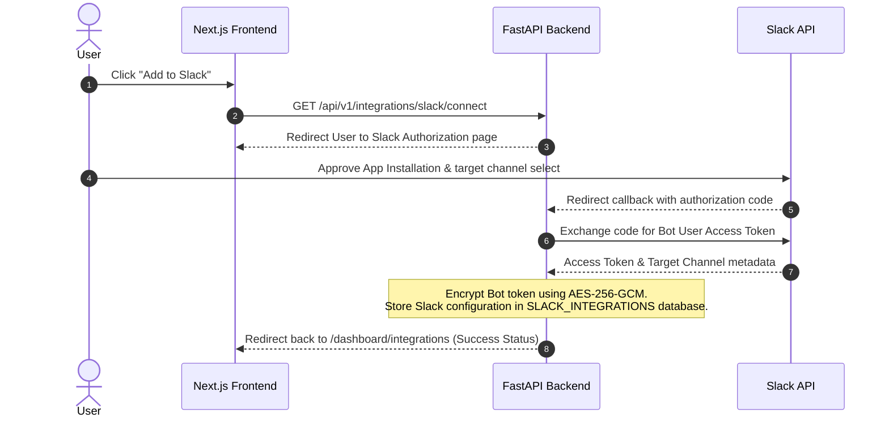
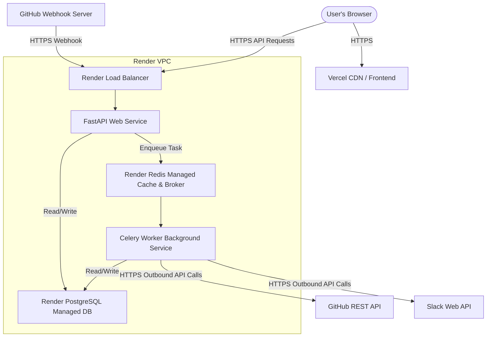

# GitHub Automation Bot Architecture Design

This document details the production-ready system architecture for the Event-Driven GitHub Automation Bot. The system is designed to handle asynchronous event processing, secure OAuth integrations, and real-time dashboard notifications.

---

## 1. Project Folder Structure

A monorepo structure is utilized to house both the frontend (Next.js) and backend (FastAPI) applications. This simplifies local development, shared typing/documentation reference, and unified CI/CD pipelines.

```
/
├── backend/                         # FastAPI Application Root
│   ├── alembic/                     # Database migrations
│   │   ├── versions/
│   │   └── env.py
│   ├── app/
│   │   ├── api/                     # API Routers
│   │   │   ├── v1/
│   │   │   │   ├── auth.py          # GitHub OAuth endpoints
│   │   │   │   ├── repos.py         # Repository configuration
│   │   │   │   ├── integrations.py  # Slack setup
│   │   │   │   ├── webhooks.py      # Webhook receiver
│   │   │   │   └── dashboard.py     # Metrics and event logging
│   │   │   └── router.py
│   │   ├── core/                    # Core Configuration
│   │   │   ├── config.py            # Environment variables & settings
│   │   │   ├── security.py          # JWT, Encryption utils (AES-256-GCM)
│   │   │   └── database.py          # SQLAlchemy engine & session factory
│   │   ├── models/                  # SQLAlchemy ORM Models
│   │   │   ├── user.py
│   │   │   ├── token.py
│   │   │   ├── repository.py
│   │   │   ├── slack.py
│   │   │   └── event.py
│   │   ├── schemas/                 # Pydantic Schemas for validation
│   │   │   ├── user.py
│   │   │   ├── repository.py
│   │   │   ├── slack.py
│   │   │   └── event.py
│   │   ├── services/                # Business Logic Providers
│   │   │   ├── github_client.py     # Octokit / GitHub API wrapper
│   │   │   ├── slack_client.py      # Slack API messaging wrapper
│   │   │   └── encryptor.py         # Reusable encryption helper
│   │   ├── tasks/                   # Celery / Background Workers
│   │   │   ├── worker.py            # Celery application configuration
│   │   │   └── webhook_tasks.py     # Event-specific task handlers
│   │   └── main.py                  # Entrypoint for FastAPI
│   ├── tests/                       # Backend tests
│   ├── Dockerfile                   # Docker configuration for FastAPI & Worker
│   ├── requirements.txt
│   └── alembic.ini
│
├── frontend/                        # Next.js Application Root
│   ├── public/                      # Static assets
│   ├── src/
│   │   ├── app/                     # Next.js App Router
│   │   │   ├── page.tsx             # Landing Page / Login
│   │   │   ├── dashboard/
│   │   │   │   ├── page.tsx         # Dashboard Overview (Metrics)
│   │   │   │   ├── repos/
│   │   │   │   │   └── page.tsx     # Connected Repositories Management
│   │   │   │   ├── integrations/
│   │   │   │   │   └── page.tsx     # Slack Integration Setup
│   │   │   │   ├── events/
│   │   │   │   │   └── page.tsx     # Live Webhook Event Logs
│   │   │   │   └── layout.tsx
│   │   │   └── layout.tsx
│   │   ├── components/              # UI components (Vanilla CSS Modules)
│   │   │   ├── Header.tsx
│   │   │   ├── Sidebar.tsx
│   │   │   ├── Card.tsx
│   │   │   ├── Table.tsx
│   │   │   └── Button.tsx
│   │   ├── hooks/                   # Custom React Hooks (e.g., useAuth)
│   │   ├── styles/                  # Global and modular CSS
│   │   │   ├── globals.css
│   │   │   ├── dashboard.module.css
│   │   │   └── components.module.css
│   │   ├── utils/                   # Fetch clients & utility functions
│   │   │   └── api.ts
│   │   └── middleware.ts            # Client session validation middleware
│   ├── package.json
│   └── next.config.js
│
└── README.md
```

---

## 2. Database Schema

A relational PostgreSQL database is used to ensure transactional integrity (ACID) and robust foreign key relationships, which are vital for tracking repository configs, credentials, and event history.

### Database ER Diagram

```mermaid
erDiagram
    USERS ||--|| GITHUB_AUTH_TOKENS : "has one"
    USERS ||--o{ REPOSITORIES : "connects"
    USERS ||--o{ SLACK_INTEGRATIONS : "configures"
    REPOSITORIES ||--o{ WEBHOOK_EVENTS : "receives"
    WEBHOOK_EVENTS ||--o{ EVENT_LOGS : "generates"

    USERS {
        uuid id PK
        string email UNIQUE
        string name
        string avatar_url
        timestamp created_at
        timestamp updated_at
    }

    GITHUB_AUTH_TOKENS {
        uuid id PK
        uuid user_id FK UNIQUE
        string access_token_encrypted
        string refresh_token_encrypted
        timestamp expires_at
        string scopes
        timestamp created_at
        timestamp updated_at
    }

    REPOSITORIES {
        uuid id PK
        uuid user_id FK
        bigint github_repo_id UNIQUE
        string name
        string owner
        string full_name
        boolean is_active
        string webhook_secret_encrypted
        bigint webhook_id
        timestamp created_at
        timestamp updated_at
    }

    SLACK_INTEGRATIONS {
        uuid id PK
        uuid user_id FK
        string bot_token_encrypted
        string webhook_url_encrypted
        string channel_id
        string channel_name
        timestamp created_at
        timestamp updated_at
    }

    WEBHOOK_EVENTS {
        uuid id PK
        uuid repository_id FK
        string delivery_id UNIQUE "X-GitHub-Delivery value"
        string event_type "e.g., issues, pull_request"
        string action "e.g., opened, closed, labeled"
        jsonb payload
        string status "pending, processing, completed, failed"
        string error_message
        timestamp created_at
        timestamp processed_at
    }

    EVENT_LOGS {
        uuid id PK
        uuid webhook_event_id FK
        string integration_type "github, slack"
        string action_type "label_added, comment_created, slack_notified"
        string status "success, failed"
        jsonb details
        timestamp created_at
    }
```

---

## 3. API Routes

### 3.1 Backend Endpoints (FastAPI)

All endpoints (except Webhook Receiver and OAuth callback) require a valid HTTP-Only Session JWT cookie.

| Category | Method | Path | Description |
| :--- | :--- | :--- | :--- |
| **Auth** | `GET` | `/api/v1/auth/github` | Redirects user to GitHub OAuth authorize screen |
| | `GET` | `/api/v1/auth/github/callback` | OAuth redirect endpoint; issues HttpOnly cookie JWT |
| | `POST` | `/api/v1/auth/logout` | Clears JWT cookie |
| | `GET` | `/api/v1/auth/me` | Returns details of logged-in user |
| **Repos** | `GET` | `/api/v1/repos` | Lists user's connected & available repositories |
| | `POST` | `/api/v1/repos/{id}/toggle` | Enables/Disables bot monitoring (registers/deletes webhook via GitHub API) |
| **Slack** | `POST` | `/api/v1/integrations/slack` | Saves Slack App configuration or incoming webhook credentials |
| | `DELETE` | `/api/v1/integrations/slack` | Deletes Slack integration config |
| **Webhooks** | `POST` | `/api/v1/webhooks/github` | Public receiver for GitHub webhook events. Verifies signature, saves raw event, returns `202 Accepted` |
| **Dashboard**| `GET` | `/api/v1/dashboard/stats` | Returns aggregate metrics (e.g., total webhooks, successes, failure rate) |
| | `GET` | `/api/v1/dashboard/events` | Paginated listing of recent webhook events & actions taken |
| | `GET` | `/api/v1/dashboard/events/{id}` | Detailed status, logs, payload, and retry triggers for a single event |

### 3.2 Frontend Pages (Next.js App Router)

| Path | Access Control | Description |
| :--- | :--- | :--- |
| `/` | Public | Landing page featuring product benefit and "Login with GitHub" trigger. |
| `/dashboard` | Protected (JWT) | Main console displaying real-time success rates, activity charts, and system status. |
| `/dashboard/repos` | Protected (JWT) | Interactive list of GitHub repos. Allows users to switch toggle switches to install webhook listeners. |
| `/dashboard/integrations`| Protected (JWT) | Slack connection control panel. Displays current Slack target channel status. |
| `/dashboard/events` | Protected (JWT) | Live event monitoring console. Shows details of webhook logs, processing status, and retries. |

---

## 4. Authentication Flow

The system uses **GitHub OAuth** to identify users and obtain authorization tokens to access GitHub APIs on their behalf.



---

## 5. Webhook Flow

GitHub Webhooks are processed **asynchronously** to ensure that HTTP connections from GitHub do not timeout (GitHub expects a response within 10 seconds).



---

## 6. Slack Integration Flow

The integration bridges GitHub activities to Slack channels via a structured workspace connection.



---

## 7. Security Considerations

To protect user credentials and ensure overall system integrity, the following security best practices must be implemented:

1. **Token Encryption at Rest**:
   - Do **NOT** store GitHub Access/Refresh Tokens or Slack Bot Tokens in plain text.
   - Use **AES-256-GCM** encryption.
   - Store the master encryption key in a secure Environment Variable (e.g., using Render's secret environment variables), never committing it to version control.
2. **Webhook Verification**:
   - Always verify the signature of incoming webhooks using HMAC-SHA256 with the repository-specific webhook secret provided during webhook registration.
   - Use constant-time string comparison (`hmac.compare_digest`) to prevent timing attacks.
3. **OAuth Flow Security**:
   - Always implement the `state` parameter containing a unique, cryptographically secure random value stored in the user's session cache to prevent Cross-Site Request Forgery (CSRF).
4. **Session Management**:
   - Issue JWTs inside HTTP-Only, Secure, and SameSite=Lax cookies. This protects sessions from Cross-Site Scripting (XSS) extraction and mitigates CSRF risks.
5. **Least Privilege Scopes**:
   - Request narrow GitHub OAuth permissions (e.g., `repo` or `write:discussion` instead of `admin`).
6. **API Protection**:
   - Implement CORS headers restricting frontend communication exclusively to the Next.js Vercel deployment domain.
   - Deploy API rate-limiting via FastAPI middleware and Redis (e.g., 60 requests per minute per IP for authenticated routes).

---

## 8. Idempotency Strategy

Since GitHub webhooks operate on an "at-least-once" delivery policy, network retries from GitHub can cause duplicate request deliveries.

### Implementation Checklist
1. **GitHub Delivery Header Tracking**:
   - Every GitHub webhook payload includes a unique delivery UUID header: `X-GitHub-Delivery`.
2. **Unique Database Key**:
   - The `webhook_events` table contains a unique constraint on the `delivery_id` column.
3. **Deduplication on Ingestion**:
   - When a webhook is received, perform an upsert query:
     ```sql
     INSERT INTO webhook_events (delivery_id, repository_id, event_type, action, payload, status)
     VALUES (:delivery_id, :repository_id, :event_type, :action, :payload, 'pending')
     ON CONFLICT (delivery_id) DO NOTHING;
     ```
   - If zero rows are inserted, immediately return `200 OK` to GitHub and discard the duplicate event.
4. **Distributed Lock (Race Mitigation)**:
   - To prevent concurrent executions of the same event if two identical requests arrive in sub-millisecond intervals, use a Redis-based distributed lock (Redlock pattern) keyed by `lock:webhook:<delivery_id>` before worker execution begins.

---

## 9. Retry Strategy

When interacting with external APIs (GitHub and Slack), rate limits, server errors (5xx), and network blips will inevitably occur.

### Worker Queue Rules
- **Error Categorization**:
  - *Retryable Errors*: HTTP 500, 502, 503, 504 (Server Errors) or HTTP 429 (Rate Limited).
  - *Non-Retryable Errors*: HTTP 400 (Bad Request), 401/403 (Invalid credentials/Unauthorized scopes), 404 (Not Found). These fail immediately and write to system alerts.
- **Exponential Backoff**:
  - Retry tasks using exponential backoff with jitter to prevent thunderous herd problems on external APIs.
  - Formula: $Backoff = Base \times 2^{retry\_count} + jitter$ (e.g., retry 1: ~2s, retry 2: ~4s, retry 3: ~8s, retry 4: ~16s).
- **Handling Rate Limits (HTTP 429)**:
  - If a 429 is encountered, inspect the `Retry-After` header (or GitHub's `x-ratelimit-reset` epoch).
  - Schedule the Celery task retry specifically for that epoch time.
- **Dead Letter Queue (DLQ)**:
  - Set a maximum retry limit of **5**.
  - If a task fails 5 times, mark the webhook event status as `failed` in the database and alert the user's dashboard.

---

## 10. Deployment Architecture

The application is deployed across fully-managed, scale-to-zero friendly server ecosystems: Vercel for the frontend, and Render for backend services.



### Production Deployment Spec

1. **Frontend (Vercel)**:
   - Next.js build optimization, global CDN deployment, Edge middleware route authentication checks.
2. **Backend Web Service (Render)**:
   - Runs the FastAPI web application inside a Docker container.
   - Health check endpoint configured at `/api/v1/auth/me` or a custom `/health` endpoint.
3. **Background Worker (Render)**:
   - Configured as a Render "Background Service" sharing the same codebase but running the worker start command:
     `celery -A app.tasks.worker.celery_app worker --loglevel=info`
4. **Database (Render PostgreSQL)**:
   - Managed Postgres instance.
   - Autoscaling disk space and automated daily snapshots.
5. **Broker/Cache (Render Redis)**:
   - Securely accessible only inside the Render Private Network (VPC) to serve as Celery's task broker and rate-limiting store.
