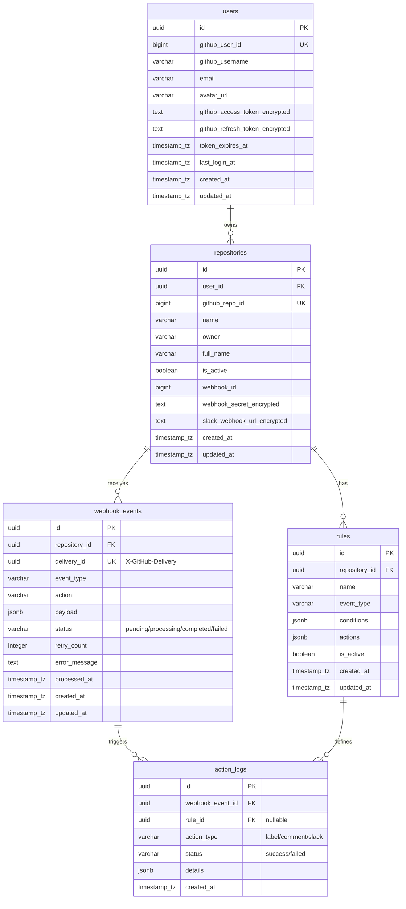

# Database Design: GitHub Automation Bot

This document outlines the database schema, SQLAlchemy models, and Alembic migrations optimized for the Event-Driven GitHub Automation Bot. It is designed to be highly reliable, supporting webhook idempotency, automation rules, and failure auditing.

---

## 1. Entity Relationship (ER) Diagram



---

## 2. PostgreSQL CREATE TABLE Statements (DDL)

```sql
-- Enable UUID extension
CREATE EXTENSION IF NOT EXISTS "uuid-ossp";

-- Table: users
CREATE TABLE users (
    id UUID PRIMARY KEY DEFAULT uuid_generate_v4(),
    github_user_id BIGINT UNIQUE NOT NULL,
    github_username VARCHAR(255) NOT NULL,
    email VARCHAR(255),
    avatar_url VARCHAR(255),
    github_access_token_encrypted TEXT NOT NULL,
    github_refresh_token_encrypted TEXT,
    token_expires_at TIMESTAMP WITH TIME ZONE,
    last_login_at TIMESTAMP WITH TIME ZONE,
    created_at TIMESTAMP WITH TIME ZONE NOT NULL DEFAULT NOW(),
    updated_at TIMESTAMP WITH TIME ZONE NOT NULL DEFAULT NOW()
);

-- Table: repositories
CREATE TABLE repositories (
    id UUID PRIMARY KEY DEFAULT uuid_generate_v4(),
    user_id UUID NOT NULL REFERENCES users(id) ON DELETE CASCADE,
    github_repo_id BIGINT UNIQUE NOT NULL,
    name VARCHAR(255) NOT NULL,
    owner VARCHAR(255) NOT NULL,
    full_name VARCHAR(255) NOT NULL,
    is_active BOOLEAN NOT NULL DEFAULT TRUE,
    webhook_id BIGINT,
    webhook_secret_encrypted TEXT,
    slack_webhook_url_encrypted TEXT,
    created_at TIMESTAMP WITH TIME ZONE NOT NULL DEFAULT NOW(),
    updated_at TIMESTAMP WITH TIME ZONE NOT NULL DEFAULT NOW()
);

-- Table: rules
CREATE TABLE rules (
    id UUID PRIMARY KEY DEFAULT uuid_generate_v4(),
    repository_id UUID NOT NULL REFERENCES repositories(id) ON DELETE CASCADE,
    name VARCHAR(255) NOT NULL,
    event_type VARCHAR(50) NOT NULL, -- e.g., 'issues', 'pull_request'
    conditions JSONB NOT NULL DEFAULT '{}'::jsonb,
    actions JSONB NOT NULL DEFAULT '[]'::jsonb,
    is_active BOOLEAN NOT NULL DEFAULT TRUE,
    created_at TIMESTAMP WITH TIME ZONE NOT NULL DEFAULT NOW(),
    updated_at TIMESTAMP WITH TIME ZONE NOT NULL DEFAULT NOW()
);

-- Table: webhook_events
CREATE TABLE webhook_events (
    id UUID PRIMARY KEY DEFAULT uuid_generate_v4(),
    repository_id UUID REFERENCES repositories(id) ON DELETE SET NULL,
    delivery_id UUID UNIQUE NOT NULL, -- UUID from X-GitHub-Delivery header
    event_type VARCHAR(50) NOT NULL,
    action VARCHAR(50),
    payload JSONB NOT NULL,
    status VARCHAR(20) NOT NULL DEFAULT 'pending', -- pending, processing, completed, failed
    retry_count INTEGER NOT NULL DEFAULT 0,
    error_message TEXT,
    processed_at TIMESTAMP WITH TIME ZONE,
    created_at TIMESTAMP WITH TIME ZONE NOT NULL DEFAULT NOW(),
    updated_at TIMESTAMP WITH TIME ZONE NOT NULL DEFAULT NOW()
);

-- Table: action_logs
CREATE TABLE action_logs (
    id UUID PRIMARY KEY DEFAULT uuid_generate_v4(),
    webhook_event_id UUID NOT NULL REFERENCES webhook_events(id) ON DELETE CASCADE,
    rule_id UUID REFERENCES rules(id) ON DELETE SET NULL,
    action_type VARCHAR(50) NOT NULL, -- add_label, create_comment, send_slack
    status VARCHAR(20) NOT NULL, -- success, failed
    details JSONB NOT NULL DEFAULT '{}'::jsonb,
    created_at TIMESTAMP WITH TIME ZONE NOT NULL DEFAULT NOW()
);
```

---

## 3. Recommended Indexes

Proper index selection prevents performance bottlenecks, especially during high-throughput webhook spikes.

```sql
-- 1. Repositories owner and name lookup index (for webhook ingestion path)
CREATE INDEX idx_repositories_owner_name ON repositories(owner, name);

-- 2. Rules evaluation lookup index (fetching active rules for a specific repo and event)
CREATE INDEX idx_rules_repo_event_active ON rules(repository_id, event_type) WHERE is_active = TRUE;

-- 3. Webhook events lookup by status (for Celery retry scheduler / cleanup cron jobs)
CREATE INDEX idx_webhook_events_status ON webhook_events(status);

-- 4. Foreign key lookup indexes (speeds up JOIN operations and cascading deletes)
CREATE INDEX idx_repositories_user_id ON repositories(user_id);
CREATE INDEX idx_rules_repository_id ON rules(repository_id);
CREATE INDEX idx_webhook_events_repository_id ON webhook_events(repository_id);
CREATE INDEX idx_action_logs_webhook_event_id ON action_logs(webhook_event_id);
CREATE INDEX idx_action_logs_rule_id ON action_logs(rule_id);
```

---

## 4. SQLAlchemy 2.0 ORM Models

These models leverage SQLAlchemy 2.0 style syntax (`Mapped` type hints and `mapped_column`).

### `backend/app/models/base.py`
```python
from datetime import datetime
from sqlalchemy.orm import DeclarativeBase, Mapped, mapped_column
from sqlalchemy.sql import func
from sqlalchemy.types import DateTime

class Base(DeclarativeBase):
    pass

class TimestampMixin:
    created_at: Mapped[datetime] = mapped_column(
        DateTime(timezone=True), 
        server_default=func.now(), 
        nullable=False
    )
    updated_at: Mapped[datetime] = mapped_column(
        DateTime(timezone=True), 
        server_default=func.now(), 
        onupdate=func.now(), 
        nullable=False
    )
```

### `backend/app/models/user.py`
```python
from datetime import datetime
from typing import List, Optional
from uuid import UUID, uuid4
from sqlalchemy.orm import Mapped, mapped_column, relationship
from sqlalchemy.types import String, BigInteger, Text, DateTime
from backend.app.models.base import Base, TimestampMixin

class User(Base, TimestampMixin):
    __tablename__ = "users"

    id: Mapped[UUID] = mapped_column(primary_key=True, default=uuid4)
    github_user_id: Mapped[int] = mapped_column(BigInteger, unique=True, nullable=False)
    github_username: Mapped[str] = mapped_column(String(255), nullable=False)
    email: Mapped[Optional[str]] = mapped_column(String(255), nullable=True)
    avatar_url: Mapped[Optional[str]] = mapped_column(String(255), nullable=True)
    
    # Encrypted fields to secure API access
    github_access_token_encrypted: Mapped[str] = mapped_column(Text, nullable=False)
    github_refresh_token_encrypted: Mapped[Optional[str]] = mapped_column(Text, nullable=True)
    
    token_expires_at: Mapped[Optional[datetime]] = mapped_column(DateTime(timezone=True), nullable=True)
    last_login_at: Mapped[Optional[datetime]] = mapped_column(DateTime(timezone=True), nullable=True)

    # Relationships
    repositories: Mapped[List["Repository"]] = relationship(
        "Repository", back_populates="user", cascade="all, delete-orphan"
    )
```

### `backend/app/models/repository.py`
```python
from typing import List, Optional
from uuid import UUID, uuid4
from sqlalchemy import ForeignKey
from sqlalchemy.orm import Mapped, mapped_column, relationship
from sqlalchemy.types import String, BigInteger, Text, Boolean
from backend.app.models.base import Base, TimestampMixin

class Repository(Base, TimestampMixin):
    __tablename__ = "repositories"

    id: Mapped[UUID] = mapped_column(primary_key=True, default=uuid4)
    user_id: Mapped[UUID] = mapped_column(ForeignKey("users.id", ondelete="CASCADE"), nullable=False)
    github_repo_id: Mapped[int] = mapped_column(BigInteger, unique=True, nullable=False)
    name: Mapped[str] = mapped_column(String(255), nullable=False)
    owner: Mapped[str] = mapped_column(String(255), nullable=False)
    full_name: Mapped[str] = mapped_column(String(255), nullable=False)
    is_active: Mapped[bool] = mapped_column(Boolean, default=True, nullable=False)
    
    webhook_id: Mapped[Optional[int]] = mapped_column(BigInteger, nullable=True)
    webhook_secret_encrypted: Mapped[Optional[str]] = mapped_column(Text, nullable=True)
    slack_webhook_url_encrypted: Mapped[Optional[str]] = mapped_column(Text, nullable=True)

    # Relationships
    user: Mapped["User"] = relationship("User", back_populates="repositories")
    rules: Mapped[List["Rule"]] = relationship(
        "Rule", back_populates="repository", cascade="all, delete-orphan"
    )
    webhook_events: Mapped[List["WebhookEvent"]] = relationship(
        "WebhookEvent", back_populates="repository", cascade="all, delete"
    )
```

### `backend/app/models/rule.py`
```python
from typing import List, Dict, Any
from uuid import UUID, uuid4
from sqlalchemy import ForeignKey
from sqlalchemy.orm import Mapped, mapped_column, relationship
from sqlalchemy.types import String, Boolean, JSON
from backend.app.models.base import Base, TimestampMixin

class Rule(Base, TimestampMixin):
    __tablename__ = "rules"

    id: Mapped[UUID] = mapped_column(primary_key=True, default=uuid4)
    repository_id: Mapped[UUID] = mapped_column(ForeignKey("repositories.id", ondelete="CASCADE"), nullable=False)
    name: Mapped[str] = mapped_column(String(255), nullable=False)
    event_type: Mapped[str] = mapped_column(String(50), nullable=False) # e.g. "issues"
    
    # Store conditions & actions as schema-flexible JSONB
    conditions: Mapped[Dict[str, Any]] = mapped_column(JSON, default=dict, nullable=False)
    actions: Mapped[List[Dict[str, Any]]] = mapped_column(JSON, default=list, nullable=False)
    
    is_active: Mapped[bool] = mapped_column(Boolean, default=True, nullable=False)

    # Relationships
    repository: Mapped["Repository"] = relationship("Repository", back_populates="rules")
    action_logs: Mapped[List["ActionLog"]] = relationship("ActionLog", back_populates="rule")
```

### `backend/app/models/event.py`
```python
from datetime import datetime
from typing import Dict, Any, List, Optional
from uuid import UUID, uuid4
from sqlalchemy import ForeignKey
from sqlalchemy.orm import Mapped, mapped_column, relationship
from sqlalchemy.types import String, Integer, Text, JSON, DateTime
from backend.app.models.base import Base, TimestampMixin

class WebhookEvent(Base, TimestampMixin):
    __tablename__ = "webhook_events"

    id: Mapped[UUID] = mapped_column(primary_key=True, default=uuid4)
    repository_id: Mapped[Optional[UUID]] = mapped_column(
        ForeignKey("repositories.id", ondelete="SET NULL"), nullable=True
    )
    delivery_id: Mapped[UUID] = mapped_column(unique=True, nullable=False) # X-GitHub-Delivery
    event_type: Mapped[str] = mapped_column(String(50), nullable=False)
    action: Mapped[Optional[str]] = mapped_column(String(50), nullable=True)
    payload: Mapped[Dict[str, Any]] = mapped_column(JSON, nullable=False)
    
    status: Mapped[str] = mapped_column(String(20), default="pending", nullable=False)
    retry_count: Mapped[int] = mapped_column(Integer, default=0, nullable=False)
    error_message: Mapped[Optional[str]] = mapped_column(Text, nullable=True)
    processed_at: Mapped[Optional[datetime]] = mapped_column(DateTime(timezone=True), nullable=True)

    # Relationships
    repository: Mapped[Optional["Repository"]] = relationship("Repository", back_populates="webhook_events")
    action_logs: Mapped[List["ActionLog"]] = relationship(
        "ActionLog", back_populates="webhook_event", cascade="all, delete"
    )
```

### `backend/app/models/action_log.py`
```python
from datetime import datetime
from typing import Dict, Any, Optional
from uuid import UUID, uuid4
from sqlalchemy import ForeignKey, func
from sqlalchemy.orm import Mapped, mapped_column, relationship
from sqlalchemy.types import String, JSON, DateTime
from backend.app.models.base import Base

class ActionLog(Base):
    __tablename__ = "action_logs"

    id: Mapped[UUID] = mapped_column(primary_key=True, default=uuid4)
    webhook_event_id: Mapped[UUID] = mapped_column(
        ForeignKey("webhook_events.id", ondelete="CASCADE"), nullable=False
    )
    rule_id: Mapped[Optional[UUID]] = mapped_column(
        ForeignKey("rules.id", ondelete="SET NULL"), nullable=True
    )
    action_type: Mapped[str] = mapped_column(String(50), nullable=False) # "label", "comment", "slack"
    status: Mapped[str] = mapped_column(String(20), nullable=False) # "success", "failed"
    details: Mapped[Dict[str, Any]] = mapped_column(JSON, default=dict, nullable=False)
    
    created_at: Mapped[datetime] = mapped_column(
        DateTime(timezone=True), server_default=func.now(), nullable=False
    )

    # Relationships
    webhook_event: Mapped["WebhookEvent"] = relationship("WebhookEvent", back_populates="action_logs")
    rule: Mapped[Optional["Rule"]] = relationship("Rule", back_populates="action_logs")
```

---

## 5. Alembic Migration Script

This is the initial database migration script generated by Alembic, including index declarations and cascading constraints.

### `backend/alembic/versions/20260703_init_schema.py`
```python
"""initial database schema

Revision ID: 52b6b461cda0
Revises: 
Create Date: 2026-07-03 17:36:00.000000

"""
from alembic import op
import sqlalchemy as sa
from sqlalchemy.dialects import postgresql

# revision identifiers, used by Alembic.
revision = '52b6b461cda0'
down_revision = None
branch_labels = None
depends_on = None

def upgrade() -> None:
    # 1. Enable UUID Extension
    op.execute('CREATE EXTENSION IF NOT EXISTS "uuid-ossp"')

    # 2. Create "users" Table
    op.create_table(
        'users',
        sa.Column('id', sa.UUID(), server_default=sa.text('uuid_generate_v4()'), nullable=False),
        sa.Column('github_user_id', sa.BigInteger(), nullable=False),
        sa.Column('github_username', sa.String(length=255), nullable=False),
        sa.Column('email', sa.String(length=255), nullable=True),
        sa.Column('avatar_url', sa.String(length=255), nullable=True),
        sa.Column('github_access_token_encrypted', sa.Text(), nullable=False),
        sa.Column('github_refresh_token_encrypted', sa.Text(), nullable=True),
        sa.Column('token_expires_at', sa.DateTime(timezone=True), nullable=True),
        sa.Column('last_login_at', sa.DateTime(timezone=True), nullable=True),
        sa.Column('created_at', sa.DateTime(timezone=True), server_default=sa.text('now()'), nullable=False),
        sa.Column('updated_at', sa.DateTime(timezone=True), server_default=sa.text('now()'), nullable=False),
        sa.PrimaryKeyConstraint('id'),
        sa.UniqueConstraint('github_user_id')
    )

    # 3. Create "repositories" Table
    op.create_table(
        'repositories',
        sa.Column('id', sa.UUID(), server_default=sa.text('uuid_generate_v4()'), nullable=False),
        sa.Column('user_id', sa.UUID(), nullable=False),
        sa.Column('github_repo_id', sa.BigInteger(), nullable=False),
        sa.Column('name', sa.String(length=255), nullable=False),
        sa.Column('owner', sa.String(length=255), nullable=False),
        sa.Column('full_name', sa.String(length=255), nullable=False),
        sa.Column('is_active', sa.Boolean(), server_default='true', nullable=False),
        sa.Column('webhook_id', sa.BigInteger(), nullable=True),
        sa.Column('webhook_secret_encrypted', sa.Text(), nullable=True),
        sa.Column('slack_webhook_url_encrypted', sa.Text(), nullable=True),
        sa.Column('created_at', sa.DateTime(timezone=True), server_default=sa.text('now()'), nullable=False),
        sa.Column('updated_at', sa.DateTime(timezone=True), server_default=sa.text('now()'), nullable=False),
        sa.ForeignKeyConstraint(['user_id'], ['users.id'], ondelete='CASCADE'),
        sa.PrimaryKeyConstraint('id'),
        sa.UniqueConstraint('github_repo_id')
    )
    op.create_index('idx_repositories_user_id', 'repositories', ['user_id'])
    op.create_index('idx_repositories_owner_name', 'repositories', ['owner', 'name'])

    # 4. Create "rules" Table
    op.create_table(
        'rules',
        sa.Column('id', sa.UUID(), server_default=sa.text('uuid_generate_v4()'), nullable=False),
        sa.Column('repository_id', sa.UUID(), nullable=False),
        sa.Column('name', sa.String(length=255), nullable=False),
        sa.Column('event_type', sa.String(length=50), nullable=False),
        sa.Column('conditions', postgresql.JSONB(astext_type=sa.Text()), server_default='{}', nullable=False),
        sa.Column('actions', postgresql.JSONB(astext_type=sa.Text()), server_default='[]', nullable=False),
        sa.Column('is_active', sa.Boolean(), server_default='true', nullable=False),
        sa.Column('created_at', sa.DateTime(timezone=True), server_default=sa.text('now()'), nullable=False),
        sa.Column('updated_at', sa.DateTime(timezone=True), server_default=sa.text('now()'), nullable=False),
        sa.ForeignKeyConstraint(['repository_id'], ['repositories.id'], ondelete='CASCADE'),
        sa.PrimaryKeyConstraint('id')
    )
    op.create_index('idx_rules_repository_id', 'rules', ['repository_id'])
    op.create_index(
        'idx_rules_repo_event_active', 
        'rules', 
        ['repository_id', 'event_type'], 
        postgresql_where=sa.text('is_active = TRUE')
    )

    # 5. Create "webhook_events" Table
    op.create_table(
        'webhook_events',
        sa.Column('id', sa.UUID(), server_default=sa.text('uuid_generate_v4()'), nullable=False),
        sa.Column('repository_id', sa.UUID(), nullable=True),
        sa.Column('delivery_id', sa.UUID(), nullable=False),
        sa.Column('event_type', sa.String(length=50), nullable=False),
        sa.Column('action', sa.String(length=50), nullable=True),
        sa.Column('payload', postgresql.JSONB(astext_type=sa.Text()), nullable=False),
        sa.Column('status', sa.String(length=20), server_default='pending', nullable=False),
        sa.Column('retry_count', sa.Integer(), server_default='0', nullable=False),
        sa.Column('error_message', sa.Text(), nullable=True),
        sa.Column('processed_at', sa.DateTime(timezone=True), nullable=True),
        sa.Column('created_at', sa.DateTime(timezone=True), server_default=sa.text('now()'), nullable=False),
        sa.Column('updated_at', sa.DateTime(timezone=True), server_default=sa.text('now()'), nullable=False),
        sa.ForeignKeyConstraint(['repository_id'], ['repositories.id'], ondelete='SET NULL'),
        sa.PrimaryKeyConstraint('id'),
        sa.UniqueConstraint('delivery_id')
    )
    op.create_index('idx_webhook_events_repository_id', 'webhook_events', ['repository_id'])
    op.create_index('idx_webhook_events_status', 'webhook_events', ['status'])

    # 6. Create "action_logs" Table
    op.create_table(
        'action_logs',
        sa.Column('id', sa.UUID(), server_default=sa.text('uuid_generate_v4()'), nullable=False),
        sa.Column('webhook_event_id', sa.UUID(), nullable=False),
        sa.Column('rule_id', sa.UUID(), nullable=True),
        sa.Column('action_type', sa.String(length=50), nullable=False),
        sa.Column('status', sa.String(length=20), nullable=False),
        sa.Column('details', postgresql.JSONB(astext_type=sa.Text()), server_default='{}', nullable=False),
        sa.Column('created_at', sa.DateTime(timezone=True), server_default=sa.text('now()'), nullable=False),
        sa.ForeignKeyConstraint(['rule_id'], ['rules.id'], ondelete='SET NULL'),
        sa.ForeignKeyConstraint(['webhook_event_id'], ['webhook_events.id'], ondelete='CASCADE'),
        sa.PrimaryKeyConstraint('id')
    )
    op.create_index('idx_action_logs_webhook_event_id', 'action_logs', ['webhook_event_id'])
    op.create_index('idx_action_logs_rule_id', 'action_logs', ['rule_id'])

def downgrade() -> None:
    op.drop_table('action_logs')
    op.drop_table('webhook_events')
    op.drop_table('rules')
    op.drop_table('repositories')
    op.drop_table('users')
